# PRÉ REQUISITOS:

 - Lógica e Pensamento Computacional
 - Noções de arquitetura de computadores
 - noções de sistemas operacionais
 - noções de matemática básica (teoria de conjuntos em especial)

# APRESENTAÇÃO INICIAL

 - Iinformações da instrutora

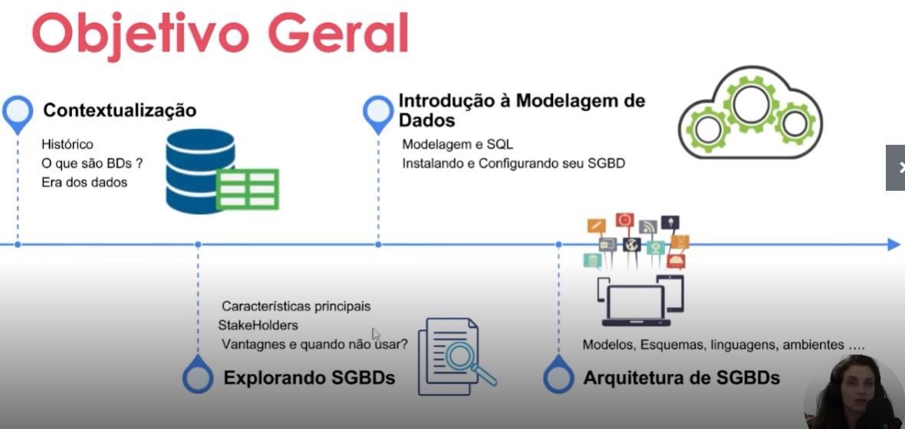

# Cenário de dados

 - Tudo são dados
 - Persistencia e confiança nos dados
 - Acesso a conta - dados relacionados a conta
 - No inicio -> tipo de dados -> numericos e textuais
 - Maior capacidade dos computadores
 - Paradigma do BigData - Velocidade, variedade e volume.

# O que são banco de dados

 - Dados são "fatos"
 - Dados relacionados -> Database
 - Conjunto de dados q transmite informação
 - "coleção de palavras, que dentre elas há relacionamentos entre dados, constituindo então um banco de dados" -> definição Geral
 - **uso + restrito**
   - contexto - representação do mundo real
   - coerência
   - propósito
 - Acesso
   - Fontes distintas persistinto dados
   - Api (acesso a banco de dados é geralmente feito por API)
   - Ações implicam em mudança de estado
   - Mudança de um estado válido para outro estado válido
     - confiável/acurado
   - o que muda é o tamanho
 - para gerenciar grandes quantidades de dados é necessario um sistema
 - Banco de dados é o conjunto de dados
 - SGBD / DBMS é o sistema q gerencia o banco de dados de um estado válido para outro

# Sistemas de Gerenciamento de Banco de dados - SGBDs

 - Software de propósito geral
   - gerenciamento de banco de dados
 - Etapas
   - Definição
     - Tipo, estrutura e regras
     - o que quero representar
   - Construção
     - Inserção de dados
     - persistencia - mapeamento
   - Manipulação
     - Recuperação
     - Relatórios
       - Query
   - Compartilhamento
     - Simultaneidade
     - Acesso
 - Ações agregadas
   - Transações
     - Retorno de dados
 - Ciclo de vida Longo
 - Proteção
   - Malfuncionamento
   - Acesso
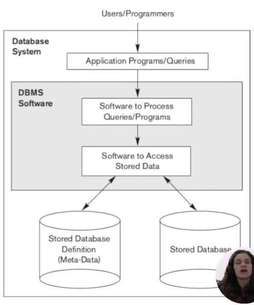
 - Definição
Componentes de um banco de dados
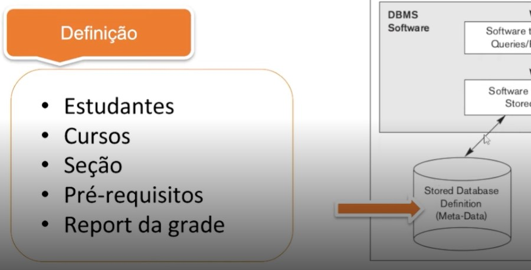
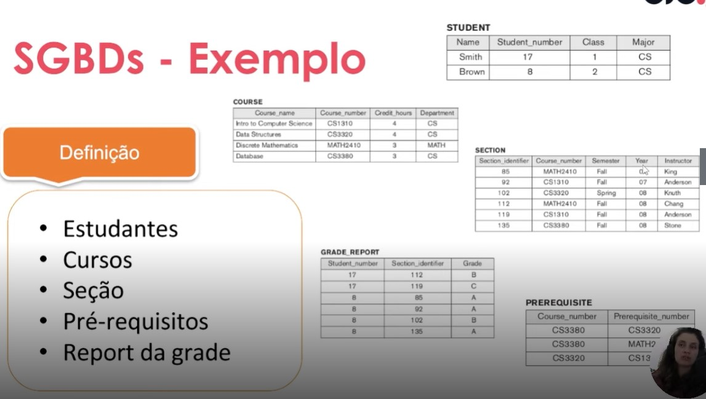
   - Metadados
     - informações que fornecem uma descrição dos dados
 - Construção
   - determina como é feito o acesso aos dados
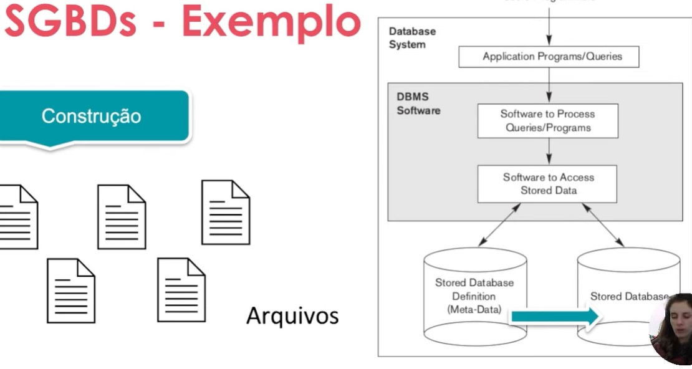
 - Manipulação
   - manutenção de banco
   - updates
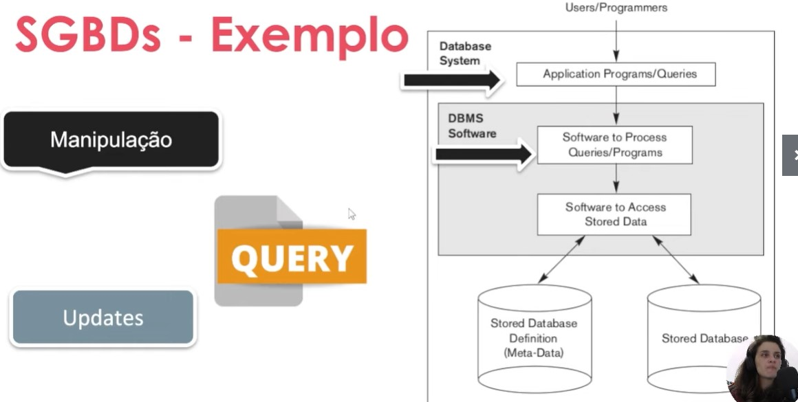
 - Compartilhamento
   - exige bloqueio para liberação das tabelas
   - bloqueia acesso de todos até a efetivação da modificção
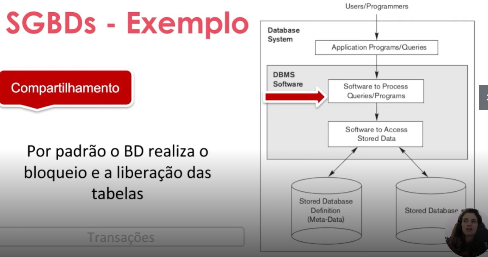
# Breve histórico de SGBDs

 - 60/70 Diminuir custos com pessoal
 - Modelos baseados em sistemas de arquivos
 - Modelo Hierarquico
 - Modelo em rede
 - modelo Relaciona
   - 1970 Artigo sobre teoria de conjuntos e Algebra Relacional
   - SQL
   - 76 1ºSGBD
   - 80 Oracle 2 SGBD
   - 83 Oracle 3 SGBD
 - Conce 

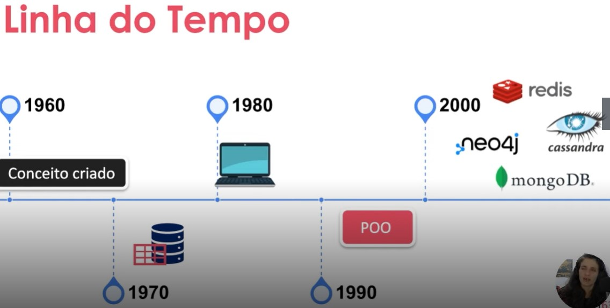

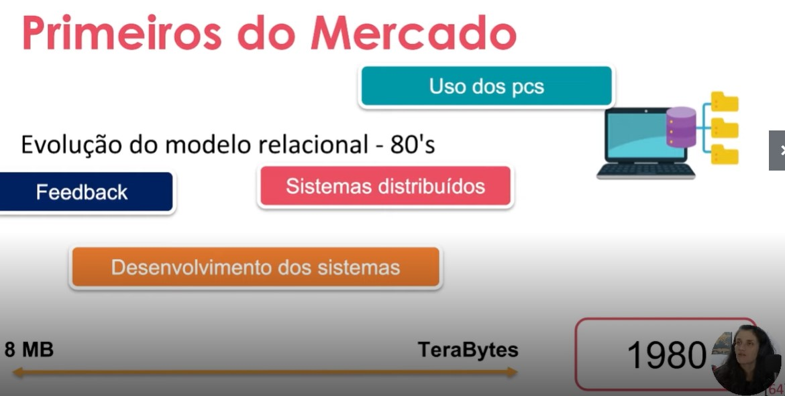

  
## Modelo Hierarquico
 
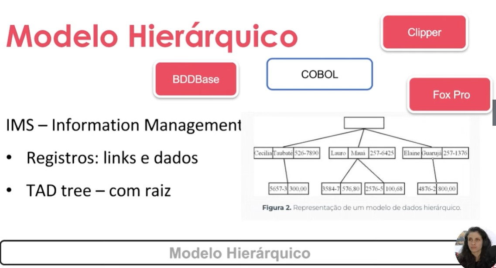
 - Organizado por dintância 
 - Registro: links e dados
 - TAD tree - com raiz

## Modelo em Rede

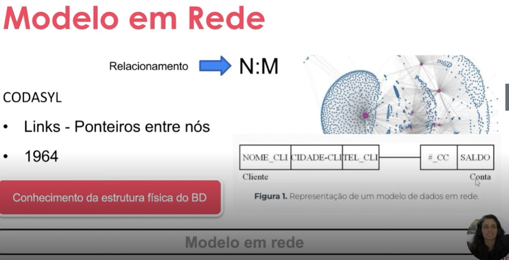
 
 - Conhecer a estrutura física da estrutura de dados
 - não existe definição da forma de relacionar

# Modelo de Banco de Dados Relacional

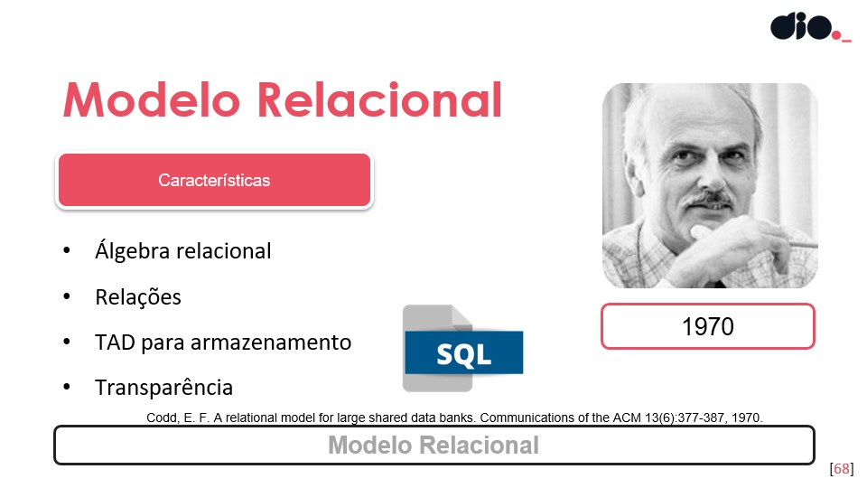

 - Abstração matemática da relação
 - Algebra relacional

  - Definido pelo Administrador de banco de dados

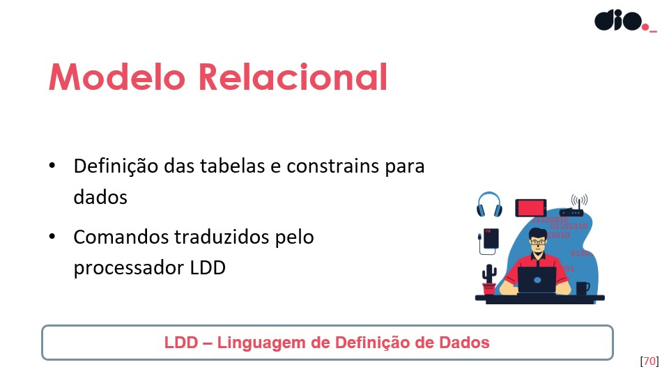

 - manutenção

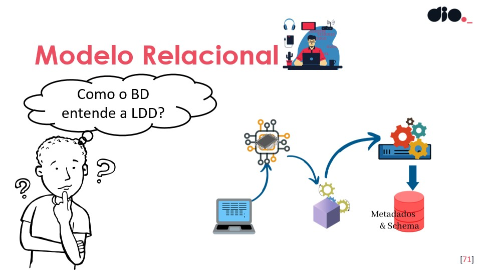

usuario comum

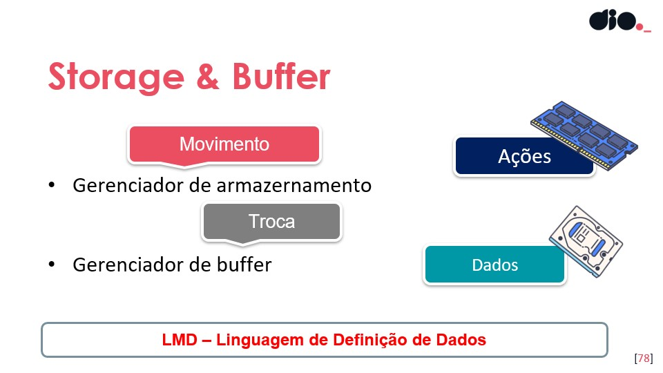
tratado pelo sitema operacional

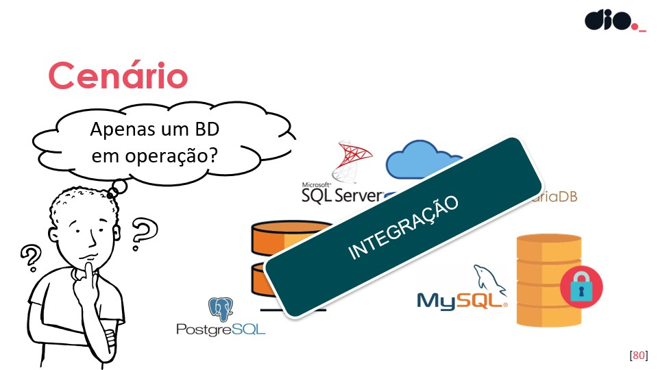
integrar diversas tecnologias de sgdbs

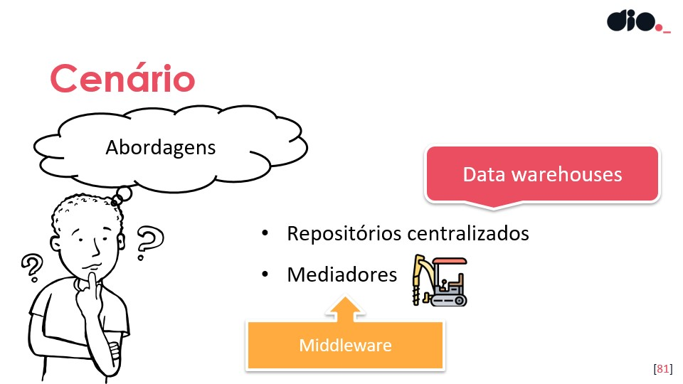
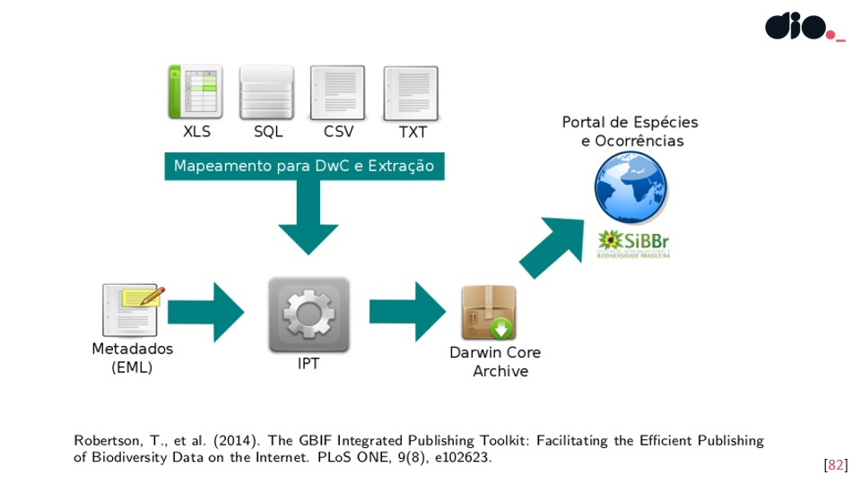
fontes diversas isendo integradas para ter um resultado
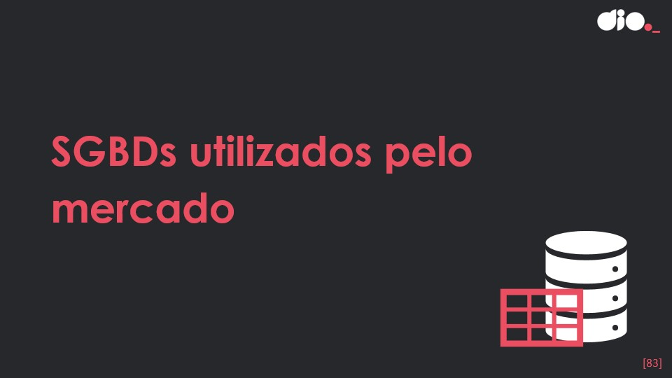

# SGBDs mais utilizados pelo mercado
# A era dos dados e o futuro da modelagem - Parte 1
# A era dos dados e o futuro da modelagem - Parte 2
# Novo cenário e novas tecnologias - E agora?CENÁRIO DE DADOS

