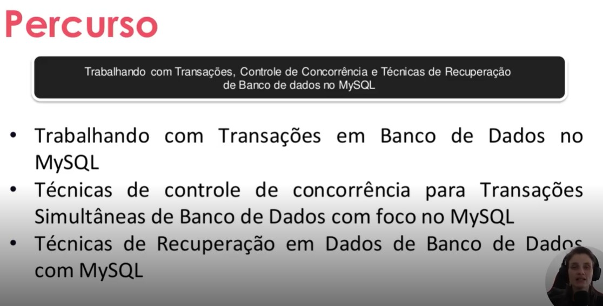

# Curso 01 - Data Base Experience

Com o Fim da preparação, o foco neste repositório é e efetivamente fazer todo o curso proposto no Database Experience

# Introdução a Banco de Dados

# Sistemas de Gerenciamento de Banco de Dados
# Modelagem de Dados para Banco de Dados
# Arquitetura de Banco de Dados
# Fundamentos de Modelagem e Projeto de Banco de Dados
# Modelo de Entidade Relacionamento com Banco de Dados
# Modelo Relacionamento de Entidade Aprimorado com Banco de Dados
# Refinando um Projeto Conceitual de Banco de Dados – E-COMMERCE
# Construindo um Esquema Conceitual para Banco De dados
# Modelo Relacional e Mapeamento Relacional com Banco de Dados
# Primeiros Passos com SQL
# Explorando Queries com SQL
# Criando Queries com Funções e Cláusulas de Agrupamentos
# Agrupando Registros e Tabelas com Join Statement
# Construindo seu Primeiro Projeto Lógico de Banco de Dados
# Construa um Projeto Lógico de Banco de Dados do Zero

